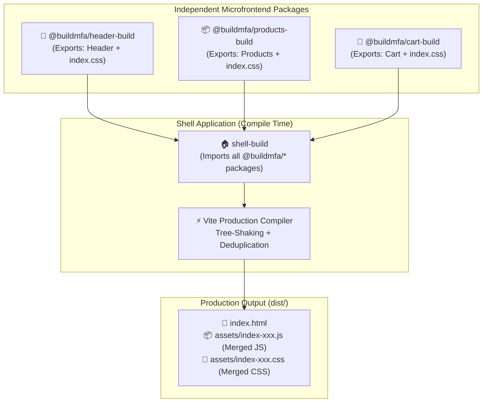

# 📦 Build-Time Microfrontend Architecture (NPM / Package-Based)

A production-ready **Build-Time Microfrontend (MFE)** storefront powered by **React 19** and **Vite 8**, demonstrating how independent microfrontends are developed as standalone component packages and assembled into a unified shell application at build time.

---

## 📑 Table of Contents
1. [Architecture Overview](#-architecture-overview)
2. [What Makes This "Build-Time"?](#-what-makes-this-build-time)
3. [Applications & Packages Matrix](#-applications--packages-matrix)
4. [Package Publishing & Subpath Exports](#-package-publishing--subpath-exports)
5. [Quickstart & Running Locally](#-quickstart--running-locally)
6. [Production Build Characteristics](#-production-build-characteristics)
7. [Key Technical Gotchas & Solutions](#-key-technical-gotchas--solutions)
8. [Directory Structure](#-directory-structure)

---

## 🏛️ Architecture Overview

In a **Build-Time Microfrontend** architecture, each domain microfrontend (`header-build`, `products-build`, `cart-build`) is packaged as an independent library package with its own build pipeline, component styles, and `peerDependencies`. 

The **`shell-build`** application consumes these packages as dependencies and compiles them together into a single, cohesive static bundle.



---

## ⚡ What Makes This "Build-Time"?

| Feature | 📦 Build-Time (This Architecture) | 🌐 Runtime (Module Federation) |
| :--- | :--- | :--- |
| **Integration Point** | **Build time** via package compiler (`vite build`) | **Runtime** in client browser via HTTP fetch |
| **Asset Delivery** | Merged into single static `dist/` bundle | Multiple remote entry files from different hosts |
| **Loading Latency** | 🚀 **0ms network delay** for remote scripts | Waterfall HTTP requests for `remoteEntry.js` |
| **Dependency Safety** | Compile-time deduplication; single React instance guaranteed | Dynamic runtime negotiation of shared libraries |
| **Deploy Independence**| Sub-app changes require rebuilding & redeploying shell | Sub-apps can be deployed without rebuilding shell |
| **Hosting Requirement**| Simple static host (AWS S3, Vercel, Netlify, Nginx) | Multiple servers/ports or CDN paths for remotes |

---

## 🔌 Applications & Packages Matrix

| Package Name | Folder | Type | Exported Component | Stylesheet Export |
| :--- | :--- | :---: | :--- | :--- |
| **`@buildmfa/header-build`** | `/header-build` | Library | `Header` (Named & Default) | `@buildmfa/header-build/index.css` |
| **`@buildmfa/products-build`**| `/products-build` | Library | `Products` (Named & Default) | `@buildmfa/products-build/index.css` |
| **`@buildmfa/cart-build`** | `/cart-build` | Library | `Cart` (Named & Default) | `@buildmfa/cart-build/index.css` |
| **`shell-build`** | `/shell-build` | Host App | Consumes all packages | Combines all stylesheets |

---

## 📦 Package Publishing & Subpath Exports

Each microfrontend is configured with Vite's **Library Mode** (`build.lib`) and standard Node.js **Package Subpath Exports**:

### 1. Vite Library Mode (`vite.config.js`)
```javascript
export default defineConfig({
  plugins: [react()],
  build: {
    lib: {
      entry: "index.js",
      name: "Products",
      fileName: "index",
      formats: ["es"],
    },
    rollupOptions: {
      external: [
        "react",
        "react-dom",
        "react/jsx-runtime",
        "react/jsx-dev-runtime",
      ],
    },
  },
});
```

### 2. Package Exports (`package.json`)
```json
{
  "name": "@buildmfa/products-build",
  "version": "0.0.0",
  "type": "module",
  "main": "./dist/index.js",
  "module": "./dist/index.js",
  "exports": {
    ".": "./dist/index.js",
    "./dist/*": "./dist/*",
    "./index.css": "./dist/index.css",
    "./style.css": "./dist/index.css"
  },
  "files": ["dist"],
  "peerDependencies": {
    "react": "^19.0.0",
    "react-dom": "^19.0.0"
  }
}
```

---

## 🚀 Quickstart & Running Locally

### Step 1: Build & Pack the Microfrontends
Build each microfrontend library into its distribution bundle and package tarball:

```bash
# 1. Header
cd header-build && npm run build && npm pack && cd ..

# 2. Products
cd products-build && npm run build && npm pack && cd ..

# 3. Cart
cd cart-build && npm run build && npm pack && cd ..
```

### Step 2: Install Packages & Run the Shell
```bash
cd shell-build
npm install
npm run dev
```
Open **`http://localhost:5173`** (or the port indicated by Vite) to view the assembled storefront.

### Step 3: Production Build
```bash
cd shell-build
npm run build
```
Generates a fully optimized, tree-shaken, production-ready static site inside `shell-build/dist/`.

---

## 🛠️ Key Technical Gotchas & Solutions

### 1. Duplicate React & "Invalid Hook Call" Error
- **Problem**: If sub-packages bundle their own React instance, two React runtimes conflict in memory when loaded into the shell.
- **Solution**: Sub-packages mark `react`, `react-dom`, `react/jsx-runtime`, and `react/jsx-dev-runtime` in `rollupOptions.external` and declare them under `peerDependencies`.

### 2. Vite Subpath Wildcard Resolution
- **Problem**: Defining `"./*": "./dist/*"` in `exports` maps `@buildmfa/products-build/dist/index.css` to `./dist/dist/index.css`, breaking stylesheet imports.
- **Solution**: Use explicit subpath mappings:
  ```json
  "exports": {
    ".": "./dist/index.js",
    "./dist/*": "./dist/*",
    "./index.css": "./dist/index.css"
  }
  ```

### 3. Missing JSX Runtime in External List
- **Problem**: Omitting `react/jsx-runtime` causes Vite/Rolldown to bundle CommonJS JSX helpers, triggering `Error: Calling require for "react" in an environment that doesn't expose require`.
- **Solution**: Explicitly include `"react/jsx-runtime"` and `"react/jsx-dev-runtime"` in `rollupOptions.external`.

---

## 📂 Directory Structure

```
Buildtime-Microfrontend/
├── header-build/          # Top navigation bar library
│   ├── src/               # Header.jsx, header.css
│   ├── index.js           # Package entry export
│   ├── package.json       # Subpath exports & peerDependencies
│   └── vite.config.js     # Library mode build configuration
│
├── products-build/        # Product catalog library
│   ├── src/               # Products.jsx, Product.jsx, product.css
│   ├── utils/             # Mock catalog data
│   ├── index.js           # Package entry export
│   ├── package.json
│   └── vite.config.js
│
├── cart-build/            # Shopping cart library
│   ├── src/               # Cart.jsx, cart.css
│   ├── index.js           # Package entry export
│   ├── package.json
│   └── vite.config.js
│
└── shell-build/           # Application Host Container
    ├── src/
    │   ├── App.jsx        # Imports and mounts Header, Products, Cart
    │   └── main.jsx
    ├── package.json       # Declares @buildmfa/* dependencies
    └── vite.config.js
```
