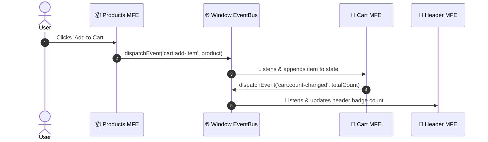

# 🌐 Microfrontend (MFA) Learning Repository

A comprehensive, production-grade reference repository demonstrating the **three primary architectures** for building Microfrontends with **React 19**, **Vite 8**, and **Node.js Express**.

---

## 🏛️ Architectural Comparison Matrix

| Feature | 🌐 [Runtime-Microfrontend](./Runtime-Microfrontend) | 📦 [Buildtime-Microfrontend](./Buildtime-Microfrontend) | 🖥️ [ServerSide-Microfrontend](./ServerSide-Microfrontend) |
| :--- | :--- | :--- | :--- |
| **Technology** | Vite Module Federation (`@originjs/vite-plugin-federation`) | NPM Packages / Subpath Exports / Vite Library Mode | Express SSR (`renderToString`) + Islands Hydration (`hydrateRoot`) |
| **Composition** | Dynamic browser HTTP fetch at runtime | Static compilation into shell at build time | Server-side parallel fetch (`Promise.all`) + HTML assembly |
| **First Paint (FCP)**| Requires loading shell + fetching remote scripts | Fast (Single pre-compiled static bundle) | 🚀 **Instant (0ms FCP)** (Raw HTML arrives pre-rendered) |
| **SEO & Bots** | ⚠️ Requires search bots to execute JS | ⚠️ Requires search bots to execute JS | 🏆 **100% crawlable** without client JavaScript execution |
| **Deploy Independence**| 🚀 Completely independent deployments | Requires rebuilding shell on sub-package updates | 🚀 Independent server services on separate ports |
| **Client Hydration** | React `createRoot` in client browser | React `createRoot` in client browser | Progressive Islands Hydration via `hydrateRoot` |
| **Ideal Use Case** | Large enterprise teams needing autonomous deployments | High performance sites, shared design system libraries | Content-heavy, e-commerce, SEO-critical applications |

---

## 📁 Repository Implementations

### 1. [Runtime-Microfrontend](./Runtime-Microfrontend)
> **Architecture**: Module Federation (Host & Remote Pattern)  
> **Ports**: `shell: 5173`, `header: 5174`, `products: 5175`, `cart: 5176`  
> **Description**: The Shell host dynamically downloads remote entry modules over the network at runtime. Features zero-coupling between builds, shared singletons, and dynamic state synchronization via browser `CustomEvent` bus.  
> 📖 See [Runtime-Microfrontend/README.md](./Runtime-Microfrontend/README.md) for full architecture diagrams and configuration details.

---

### 2. [Buildtime-Microfrontend](./Buildtime-Microfrontend)
> **Architecture**: Package-Based / Monorepo Library Pattern  
> **Packages**: `@buildmfa/header-build`, `@buildmfa/products-build`, `@buildmfa/cart-build`, `shell-build`  
> **Description**: Each microfrontend is built as an independent npm library with standard subpath exports and externalized React peerDependencies. The Shell consumes them directly and compiles everything into a single, tree-shaken, ultra-fast static bundle.  
> 📖 See [Buildtime-Microfrontend/README.md](./Buildtime-Microfrontend/README.md) for packaging instructions and technical gotchas.

---

### 3. [ServerSide-Microfrontend](./ServerSide-Microfrontend)
> **Architecture**: Server-Side Rendering (SSR) & Islands Hydration  
> **Ports**: `shell-server: 4000`, `header-server: 4001`, `products-server: 4002`, `cart-server: 4003`  
> **Description**: The Shell server concurrently fetches pre-rendered HTML fragments from microfrontend services in parallel. The client paints the pre-rendered HTML immediately with zero layout shift, followed by progressive hydration (`hydrateRoot`) on each island.  
> 📖 See [ServerSide-Microfrontend/README.md](./ServerSide-Microfrontend/README.md) for SSR pipeline, single-config Vite setup, and hydration workflow.

---

## 📡 Shared Cross-Microfrontend Event Bus

Across all three architectures, cross-microfrontend communication follows the **Decoupled Window Event Bus Pattern** using browser-standard `window.dispatchEvent` and `window.addEventListener`:

