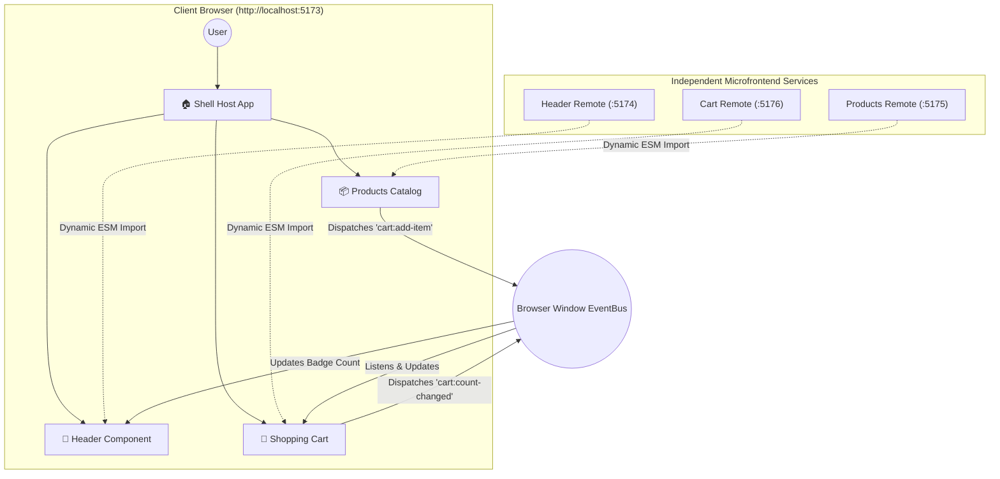
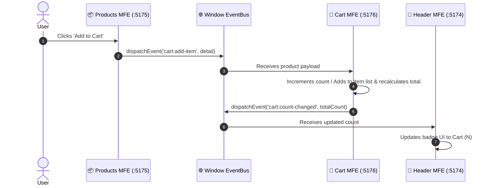

# 🌐 Runtime Microfrontend Architecture (Vite + Module Federation)

A production-grade, decoupled **Runtime Microfrontend (MFE)** storefront powered by **React 19**, **Vite 8**, and **`@originjs/vite-plugin-federation`**.

---

## 📑 Table of Contents
1. [Architecture Overview](#-architecture-overview)
2. [What Makes This "Runtime" vs "Build-Time"?](#-what-makes-this-runtime-vs-build-time)
3. [Applications & Port Matrix](#-applications--port-matrix)
4. [Cross-Microfrontend Communication (Event Bus)](#-cross-microfrontend-communication-event-bus)
5. [Quickstart & Running Locally](#-quickstart--running-locally)
6. [Key Configurations & Known Gotchas](#-key-configurations--known-gotchas)
7. [Project Structure](#-project-structure)

---

## 🏛️ Architecture Overview

The storefront uses a **Host (Container) & Remote** pattern. The **Shell** acts as the host container that dynamically fetches and stitches together remote UI components inside the client's browser at runtime.



---

## ⚡ What Makes This "Runtime" vs "Build-Time"?

| Feature | 🚀 Runtime (This Architecture) | 📦 Build-Time (NPM Packages) |
| :--- | :--- | :--- |
| **Integration Mechanism** | Loaded dynamically via browser HTTP fetch (`remoteEntry.js`) | Compiled into a single static bundle during `npm run build` |
| **Deployment Independence** | Deploy `products` independently; `shell` picks up changes on refresh | Redeploying `products` requires republishing npm package & rebuilding `shell` |
| **Host Build Speed** | Extremely fast (Shell doesn't bundle remote source code) | Slow (Shell must compile all remote dependencies) |
| **Shared Singletons** | React & ReactDOM shared dynamically in browser memory | Duplicated bundles unless strict peerDependencies are maintained |
| **Failure Tolerance** | Shell can display error boundaries / fallbacks if a remote goes down | A build break in one module prevents the whole site from building |

---

## 🔌 Applications & Port Matrix

| App | Port | Type | Exposed Module | Path | Description |
| :--- | :---: | :---: | :---: | :---: | :--- |
| **`shell`** | `5173` | Host | — | `/shell` | The orchestrator app that defines layouts and mounts remotes |
| **`header`** | `5174` | Remote | `./Header` | `/header` | Top navigation bar with live cart count indicator |
| **`products`** | `5175` | Remote | `./Products` | `/products` | Product catalog with ratings, badges, and "Add to Cart" |
| **`cart`** | `5176` | Remote | `./Cart` | `/cart` | Interactive cart drawer with item removal, quantity, & totals |

---

## 📡 Cross-Microfrontend Communication (Event Bus)

Microfrontends should be decoupled and not share mutable JavaScript state directly. This project uses native, browser-standard **`CustomEvent`** APIs on `window`:



### Event Reference
1. **`cart:add-item`**:
   - **Sender**: `Product.jsx` (Products MFE)
   - **Payload**: `{ detail: { id, name, price, image, category, brand } }`
   - **Listener**: `Cart.jsx` (Cart MFE)

2. **`cart:count-changed`**:
   - **Sender**: `Cart.jsx` (Cart MFE)
   - **Payload**: `{ detail: totalQuantity }`
   - **Listener**: `Header.jsx` (Header MFE)

---

## 🚀 Quickstart & Running Locally

### Step 1: Install Dependencies
Run `npm install` inside each application directory:
```bash
cd cart && npm install
cd ../header && npm install
cd ../products && npm install
cd ../shell && npm install
```

### Step 2: Build and Start the Remotes
Because `@originjs/vite-plugin-federation` generates `remoteEntry.js` during production build, run `preview` servers for the remotes:

```bash
# Terminal 1: Header Remote
cd header
npm run build && npm run preview

# Terminal 2: Products Remote
cd products
npm run build && npm run preview

# Terminal 3: Cart Remote
cd cart
npm run build && npm run preview
```

### Step 3: Start the Shell Host
In a 4th terminal:
```bash
cd shell
npm run dev
```

Open your browser at:
👉 **`http://localhost:5173`**

---

## 💡 Key Configurations & Known Gotchas

### 1. Vite 8 / Rolldown Minification Bug (`e.forEach is not a function`)
* **Problem**: Vite 8 uses the Rust-based Rolldown bundler. When `minify: true`, Rolldown formats internal CSS module paths as template literals using backticks (`` `__v__css__...` ``). The federation plugin's regex only matches single/double quotes (`/["']__v__css__/`), leaving the string unparsed and causing a runtime `e.forEach is not a function` error.
* **Fix Applied**: In all remote `vite.config.js` files:
  ```javascript
  build: {
    target: "esnext",
    minify: false, // Preserves standard quotes for CSS bundle replacement
  }
  ```

### 2. CORS (Cross-Origin Resource Sharing)
* **Problem**: The browser loads remote chunks from different ports (`5174`, `5175`, `5176`) into the host (`5173`).
* **Fix Applied**: `cors: true` is configured in both `server` and `preview` for all remotes.

### 3. Remote Dev vs. Preview Mode
* `@originjs/vite-plugin-federation` only produces `remoteEntry.js` via `vite build`. Always run `npm run preview` on remote applications to serve their federated entry point.

---

## 📂 Project Structure

```
Runtime-Microfrontend/
├── README.md               # 📖 Master Architecture Documentation
├── shell/                  # 🏠 Host Application (Port 5173)
│   ├── src/
│   │   ├── App.jsx         # Composes Header, Products, and Cart
│   │   ├── App.css         # Responsive Storefront Layout
│   │   └── main.jsx
│   └── vite.config.js      # Federation Remotes Definition
├── header/                 # 🧭 Header Microfrontend (Port 5174)
│   ├── src/
│   │   ├── Header.jsx      # Header Bar + Dynamic Cart Count Badge
│   │   └── header.css
│   └── vite.config.js      # Exposes './Header'
├── products/               # 📦 Products Microfrontend (Port 5175)
│   ├── src/
│   │   ├── Product.jsx     # Product Card Component
│   │   ├── Products.jsx    # Products Catalog Grid
│   │   └── product.css     # Scoped Card Styles
│   └── vite.config.js      # Exposes './Products'
└── cart/                   # 🛒 Cart Microfrontend (Port 5176)
    ├── src/
    │   ├── Cart.jsx        # Interactive Cart Drawer / Component
    │   └── cart.css        # Scoped Cart Styles
    └── vite.config.js      # Exposes './Cart'
```
