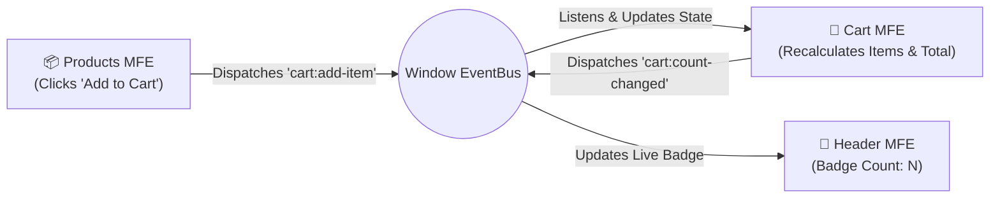

# 🖥️ Server-Side Microfrontend Architecture (SSR + Client Hydration)

A production-grade **Server-Side Microfrontend (SSR)** storefront built with **Node.js Express**, **React 19**, and **Vite 8**, featuring parallel server-side fragment composition, independent client-side hydration islands, and decoupled event-driven communication.

---

## 📑 Table of Contents
1. [Architecture Overview](#-architecture-overview)
2. [What Makes This "Server-Side"?](#-what-makes-this-server-side)
3. [Applications & Port Matrix](#-applications--port-matrix)
4. [SSR + Client Hydration Workflow](#-ssr--client-hydration-workflow)
5. [Cross-Microfrontend Event Bus](#-cross-microfrontend-event-bus)
6. [Unified Single-Config Build System](#-unified-single-config-build-system)
7. [Quickstart & Running Locally](#-quickstart--running-locally)
8. [Directory Structure](#-directory-structure)

---

## 🏛️ Architecture Overview

The storefront uses a **Server-Side Fragment Composition (Islands)** architecture:
1. When a user requests `http://localhost:4000`, the **Shell Server** concurrently fetches pre-rendered HTML fragments from the **Header**, **Products**, and **Cart** microfrontend servers in parallel (`Promise.all`).
2. The Shell injects these fragments into a responsive HTML shell and serves it immediately to the browser for lightning-fast **First Contentful Paint (FCP)** and optimal **SEO**.
3. In the browser, independent client scripts (`client.js`) hydrate their respective DOM containers (`#header-root`, `#products-root`, `#cart-root`), restoring full interactive state, click handlers, and event listeners.

```mermaid
sequenceDiagram
    autonumber
    actor Browser as 🌐 Client Browser
    participant Shell as 🏠 Shell Server (:4000)
    participant Header as 🧭 Header Server (:4001)
    participant Products as 📦 Products Server (:4002)
    participant Cart as 🛒 Cart Server (:4003)

    Browser->>Shell: GET / (Page Request)
    
    Note over Shell,Cart: Parallel Server-Side Fetch (Promise.all)
    Shell->>Header: GET / (renderToString)
    Header-->>Shell: Returns Header HTML fragment
    Shell->>Products: GET / (renderToString)
    Products-->>Shell: Returns Products HTML fragment
    Shell->>Cart: GET / (renderToString)
    Cart-->>Shell: Returns Cart HTML fragment

    Shell-->>Browser: Sends Assembled SSR HTML + Stylesheets + Client Scripts
    Note over Browser: Browser paints static HTML immediately (0ms FCP)
    
    Note over Browser,Cart: Client-Side Islands Hydration
    Browser->>Header: Fetch /client.js
    Browser->>Products: Fetch /client.js
    Browser->>Cart: Fetch /client.js
    Note over Browser: hydrateRoot runs on each island; interactive events active!
```

---

## ⚡ What Makes This "Server-Side"?

| Feature | 🖥️ Server-Side (This Architecture) | 🌐 Runtime (Client-Side Module Federation) | 📦 Build-Time (NPM Packages) |
| :--- | :--- | :--- | :--- |
| **Where Rendering Happens** | **On the Server (Node.js)** before reaching the browser | **In the Browser** after remote scripts load | **In the Browser** via a pre-compiled bundle |
| **First Contentful Paint** | 🚀 **Instant**. Raw HTML is pre-rendered | Slower (Wait for JS downloads + client mount) | Fast (Single static JS bundle) |
| **SEO & Search Engines** | 🏆 **100% crawlable**. Search bots see full HTML | ⚠️ Limited (Requires bot JS execution) | ⚠️ Requires bot JS execution |
| **Hydration Strategy** | Progressive Islands Hydration (`hydrateRoot`) | Client-side React `createRoot` | Single client `createRoot` |
| **Deployment Model** | Independent Node services running on ports | Independent static file servers / CDNs | Single static bundle deployment |

---

## 🔌 Applications & Port Matrix

| Service | Port | Role | SSR Output | Client Bundle | Stylesheet |
| :--- | :---: | :---: | :--- | :--- | :--- |
| **`shell-server`** | `4000` | Orchestrator | Assembles all fragments in parallel | Loads all client hydration scripts | Injects all MFE stylesheets |
| **`header-server`**| `4001` | Fragment | `<header id="header-root">` | `http://localhost:4001/client.js` | `http://localhost:4001/header.css` |
| **`products-server`**| `4002` | Fragment | `<section id="products-root">`| `http://localhost:4002/client.js` | `http://localhost:4002/product.css`|
| **`cart-server`** | `4003` | Fragment | `<section id="cart-root">` | `http://localhost:4003/client.js` | `http://localhost:4003/cart.css` |

---

## 🔄 SSR + Client Hydration Workflow

### 1. Server Phase (`renderToString`)
On the Node server, React renders components to static HTML strings without running client effects:
```javascript
// server-entry.jsx
import { renderToString } from "react-dom/server";
import Products from "./src/Products.jsx";

export function RenderProducts() {
  return renderToString(<Products />);
}
```

### 2. Client Hydration Phase (`hydrateRoot`)
In the browser, the client script attaches to the exact server-rendered DOM node:
```javascript
// client-entry.jsx
import React from "react";
import { hydrateRoot } from "react-dom/client";
import Products from "./src/Products.jsx";

function hydrate() {
  const root = document.getElementById("products-root");
  if (root) {
    hydrateRoot(root, <Products />);
  }
}

if (document.readyState === "loading") {
  document.addEventListener("DOMContentLoaded", hydrate);
} else {
  hydrate();
}
```

---

## 📡 Cross-Microfrontend Event Bus

Microfrontend components communicate via browser-native **`window.CustomEvent`** APIs:



---

## ⚙️ Unified Single-Config Build System

Instead of maintaining separate configuration files for server and client, each microfrontend uses a **single [`vite.config.js`](file:///Users/yogesht/Study_Material/MFA/ServerSide-Microfrontend/header-server/vite.config.js)** leveraging Vite's `isSsrBuild` conditional:

```javascript
import react from "@vitejs/plugin-react";
import { defineConfig } from "vite";

export default defineConfig(({ isSsrBuild }) => {
  // 1. SSR Build (Node.js bundle) -> dist/server-entry.js
  if (isSsrBuild) {
    return {
      plugins: [react()],
      build: {
        ssr: "./server-entry.jsx",
        rollupOptions: {
          input: "./server-entry.jsx",
        },
      },
    };
  }

  // 2. Client Hydration Build (Browser bundle) -> dist/client/client.js
  return {
    plugins: [react()],
    define: {
      "process.env.NODE_ENV": JSON.stringify("production"),
    },
    build: {
      outDir: "dist/client",
      emptyOutDir: true,
      lib: {
        entry: "client-entry.jsx",
        name: "Client",
        fileName: () => "client.js",
        formats: ["es"],
      },
    },
  };
});
```

### Build Scripts (`package.json`)
```json
"scripts": {
  "build:ssr": "vite build --ssr",
  "build:client": "vite build",
  "build": "npm run build:ssr && npm run build:client",
  "server": "node server.js"
}
```

---

## 🚀 Quickstart & Running Locally

### Step 1: Build SSR & Client Bundles
Run `npm run build` in each microfrontend service (builds both server and client in ~60ms):

```bash
cd header-server && npm run build && cd ..
cd products-server && npm run build && cd ..
cd cart-server && npm run build && cd ..
```

### Step 2: Start All 4 Servers
Open 4 separate terminal tabs:

```bash
# Terminal 1: Header Server
cd header-server && npm run server

# Terminal 2: Products Server
cd products-server && npm run server

# Terminal 3: Cart Server
cd cart-server && npm run server

# Terminal 4: Shell Orchestrator
cd shell-server && npm run server
```

### Step 3: Open in Browser
Visit **`http://localhost:4000`**:
- **Instant Paint**: Header, Product Catalog, and Cart render immediately as server-rendered HTML.
- **Interactive Hydration**: Click "Add to Cart" on any product — the item is added to the cart, totals recalculate, and the header badge updates live!

---

## 📂 Directory Structure

```
ServerSide-Microfrontend/
├── header-server/
│   ├── src/                 # Header.jsx, header.css
│   ├── server-entry.jsx     # Node SSR renderToString export
│   ├── client-entry.jsx     # Browser hydrateRoot script
│   ├── vite.config.js       # Unified single Vite config (SSR + Client)
│   ├── server.js            # Express server (:4001)
│   └── dist/                # Emitted server-entry.js & client/client.js
│
├── products-server/
│   ├── src/                 # Products.jsx, Product.jsx, product.css
│   ├── utils/               # Catalog dataset
│   ├── server-entry.jsx
│   ├── client-entry.jsx
│   ├── vite.config.js
│   ├── server.js            # Express server (:4002)
│   └── dist/
│
├── cart-server/
│   ├── src/                 # Cart.jsx, cart.css
│   ├── server-entry.jsx
│   ├── client-entry.jsx
│   ├── vite.config.js
│   ├── server.js            # Express server (:4003)
│   └── dist/
│
└── shell-server/
    ├── package.json
    └── server.js            # Express Orchestrator (:4000)
```
